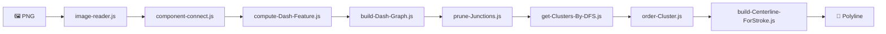
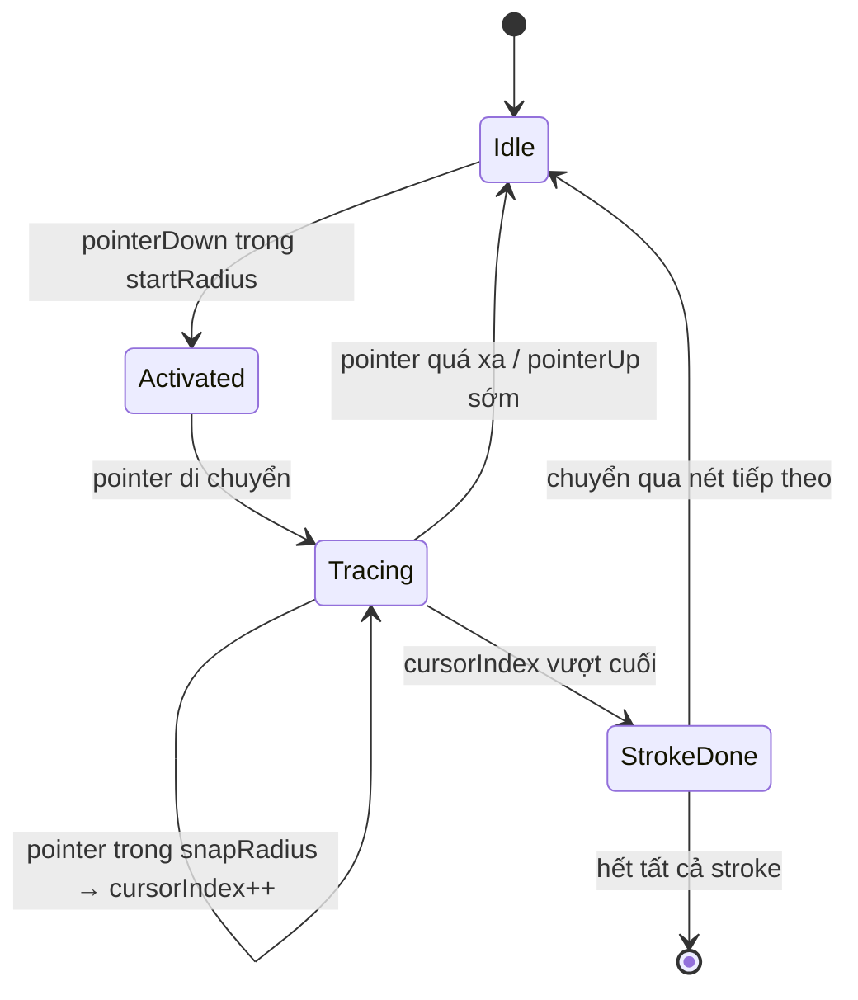
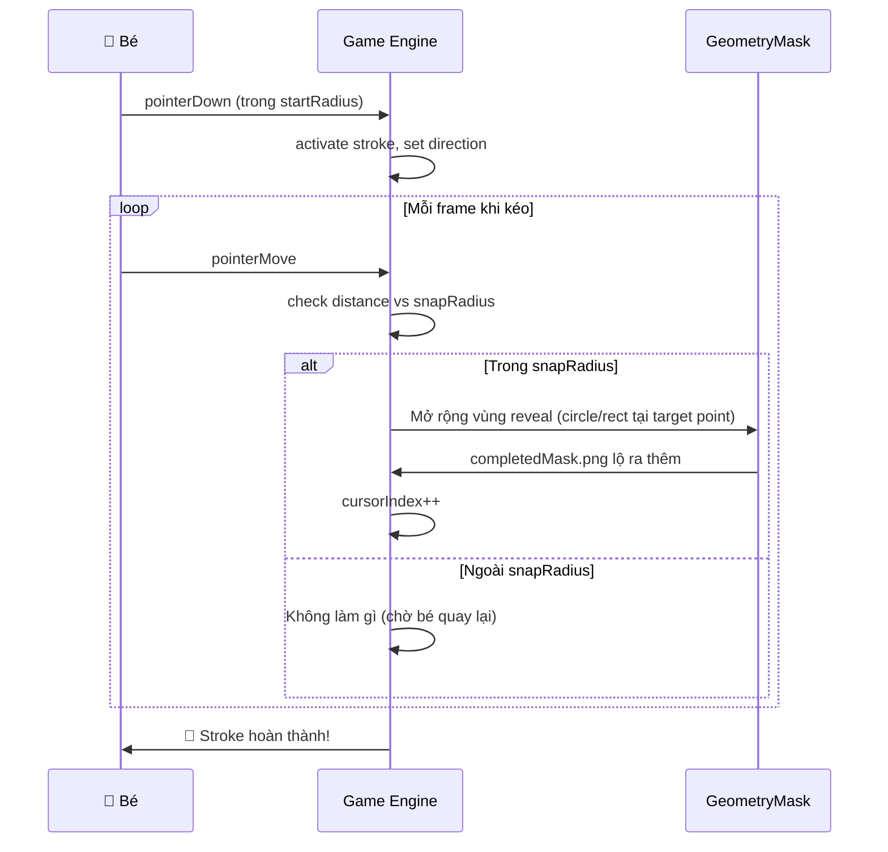
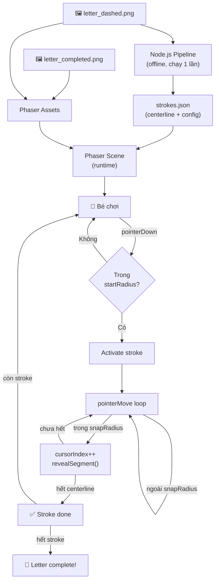

# Substrokes — Tách nét đứt (dashed stroke) từ ảnh PNG

## Tổng quan

Hệ thống đọc ảnh PNG chứa chữ cái dạng nét đứt (dashed), tách các nét nhỏ (dash), phân cụm và sắp xếp chúng thành polyline centerline — phục vụ cho hệ thống nhận diện/tracing chữ viết tay.

## Pipeline

```
PNG → Binary → Components → Features → Graph → Prune → Clusters → Order → Centerline
 1       2         3           4         5        6        7         8         9
```



---

## Cấu trúc dữ liệu

### Pixel

```js
{ x: number, y: number }
```

### Binary Image (`bin`)

```js
Uint8Array   // length = width × height
// bin[y * width + x] = 1 (nét) hoặc 0 (nền)
```

### Dash Feature

```js
{
  id:       number,        // ID duy nhất (1-indexed)
  centroid: { x, y },      // trọng tâm thống kê
  dir:      { x, y },      // vector hướng chính (đơn vị, từ PCA)
  A:        { x, y },      // endpoint đầu (projected lên trục dir)
  B:        { x, y },      // endpoint cuối (projected lên trục dir)
  M:        { x, y },      // midpoint = (A + B) / 2
  Ap:       { x, y },      // A' = đối xứng A qua M (≡ B)
  len:      number,        // chiều dài ước tính (tMax − tMin)
  area:     number,        // số pixel
}
```

### Adjacency List (`adj`)

```js
Set<number>[]  // adj[i] = Set of neighbor indices (dash index)
// max degree = 2 (sau prune)
```

### Cluster

```js
number[]       // mảng chỉ số dash thuộc cùng 1 nét liên tục
```

### Polyline (Centerline)

```js
[number, number][]  // [[x1,y1], [x2,y2], ...], 2 điểm mỗi dash
```

---

## Chi tiết từng file

### 1. [image-reader.js](file:///e:/substrokes/image-reader.js) — Đọc ảnh → mảng nhị phân

| Mục | Chi tiết |
|-----|----------|
| **Input** | Đường dẫn file PNG |
| **Output** | `{ bin, width, height }` |
| **Thư viện** | `sharp` |
| **Thuật toán** | Đọc RGBA → kiểm tra alpha (trong suốt = nền) → tính gray bằng weighted average `0.299R + 0.587G + 0.114B` → so với threshold |

**Logic quyết định pixel:**

```
alpha < 10      → bin = 0 (nền trong suốt)
gray < 128      → bin = 1 (nét tối)
gray >= 128     → bin = 0 (nền sáng)
```

---

### 2. [component-connect.js](file:///e:/substrokes/component-connect.js) — Connected Components (8-hướng)

| Mục | Chi tiết |
|-----|----------|
| **Input** | `bin, width, height, minArea` |
| **Output** | `pixels[][]` — mảng các component, mỗi component là mảng `{x, y}` |
| **Thuật toán** | **Flood Fill + DFS (stack-based)** với 8 hướng lân cận |
| **Lọc** | Bỏ component có `area < minArea` (mặc định 10) |

**8 hướng lân cận:**

```
[-1,-1] [0,-1] [1,-1]
[-1, 0]        [1, 0]
[-1, 1] [0, 1] [1, 1]
```

---

### 3. [compute-Dash-Feature.js](file:///e:/substrokes/compute-Dash-Feature.js) — Trích xuất feature hình học

| Mục | Chi tiết |
|-----|----------|
| **Input** | `pixels[]` — 1 component |
| **Output** | Dash Feature object (centroid, dir, A, B, M, Ap, len, area) |
| **Thuật toán** | **PCA (Principal Component Analysis)** đơn giản trên 2D |

**Các bước:**

1. **Centroid** — trung bình cộng tọa độ x, y
2. **Covariance matrix** — `sxx, syy, sxy` (phương sai / hiệp phương sai)
3. **Principal direction** — `θ = 0.5 × atan2(2·sxy, sxx − syy)` → `dir = (cos θ, sin θ)`
4. **Projection** — chiếu tất cả pixel lên trục `dir`, tìm `tMin, tMax`
5. **Endpoints A, B** — điểm chiếu (projected) trên trục, không phải pixel thô
6. **M, A'** — midpoint và đối xứng, dùng cho DashTraceManager

```
      A ──────── M ──────── B
      ↑          ↑          ↑
  projected   midpoint   projected
  endpoint              endpoint (= A')
```

---

### 4. [build-Dash-Graph.js](file:///e:/substrokes/build-Dash-Graph.js) — Xây graph kết nối dash

| Mục | Chi tiết |
|-----|----------|
| **Input** | `dashes[], { gapMul, angleDeg }` |
| **Output** | `{ adj, gapThreshold, angleDeg, edgeInfo }` |
| **Thuật toán** | **Endpoint-based greedy matching** với `claimed[]` tracking |

**Điều kiện nối 2 dash:**

1. ✅ Khoảng cách endpoint gần nhất < `gapThreshold` (`= gapMul × median_len`)
2. ✅ Góc giữa 2 vector `dir` < `angleDeg` (mặc định 40°)
3. ✅ Mỗi endpoint chỉ nối với **1** đối tác tốt nhất → **max degree = 2**

**Endpoint matching:**

```
Dash i [endpoint B] ──── (best match) ──── [endpoint A] Dash j
                          claimed[i].B = true
                          claimed[j].A = true
```

**`angleBetween`:** dùng `|dot product|` → đo góc nhọn 0..90° (không phân biệt chiều).

---

### 5. [prune-Junctions.js](file:///e:/substrokes/prune-Junctions.js) — Cắt nhánh sai tại junction

| Mục | Chi tiết |
|-----|----------|
| **Input** | `adj, dashes` (mutates adj in-place) |
| **Output** | void (sửa trực tiếp adj) |
| **Thuật toán** | **Score-based pruning** với asymmetric delete |

**Các bước:**

1. Với mỗi dash có degree > 2, tính score cho từng neighbor:
   - `score = |dir_i · v_ij|` — mức "thẳng hàng" giữa trục dash và hướng tới neighbor
2. Giữ tối đa 2 neighbor có score cao nhất (`wantKeep`)
3. **Xóa cạnh nếu ít nhất 1 phía không muốn giữ** → an toàn, tránh đứt chuỗi
4. Xóa một lần duy nhất (không mutation trong loop)

**Kết quả:** graph trở thành **path-like** (max degree ≤ 2).

---

### 6. [get-Clusters-By-DFS.js](file:///e:/substrokes/get-Clusters-By-DFS.js) — Tìm connected components trên graph

| Mục | Chi tiết |
|-----|----------|
| **Input** | `adj` |
| **Output** | `clusters[][]` — mỗi cluster = mảng chỉ số dash |
| **Thuật toán** | **DFS stack-based** trên adjacency list |

**3 hàm exported:**

| Hàm | Tác dụng | Thứ tự gọi |
|-----|---------|------------|
| `getClustersByDFS(adj)` | Tìm tất cả connected components | 1️⃣ |
| `filterSmallClusters(clusters, minSize)` | Lọc bỏ cluster nhỏ | 2️⃣ |
| `clustersToDashIds(clusters, dashes)` | Convert indices → dash IDs | 3️⃣ |

> [!IMPORTANT]
> Phải gọi `filterSmallClusters` **TRƯỚC** `clustersToDashIds` vì format input khác nhau.

---

### 7. [order-Cluster.js](file:///e:/substrokes/order-Cluster.js) — Sắp xếp dash trong cluster thành chuỗi

| Mục | Chi tiết |
|-----|----------|
| **Input** | `clusterIdxs, adj, dashes` |
| **Output** | `dashIds[]` — mảng dash.id theo thứ tự từ đầu → cuối |
| **Thuật toán** | **Greedy traversal** với turn penalty |

**Các bước:**

1. Tìm dash có **degree = 1** (endpoint chuỗi) → chọn cái **trái nhất** (x nhỏ nhất) làm start
2. Duyệt greedy: tại mỗi bước, chọn neighbor có **turn penalty nhỏ nhất**:
   - `turnPenalty = 1 − |prevDir · toJ|`
   - 0 = thẳng, 1 = vuông góc
3. Nếu cluster là vòng tròn (không endpoint) → fallback chọn trái nhất

**Xác định hướng:** dùng `vectorBetweenClosestEndpoints` (endpoint gần nhất, không phải centroid).

---

### 8. [build-Centerline-ForStroke.js](file:///e:/substrokes/build-Centerline-ForStroke.js) — Tạo polyline centerline

| Mục | Chi tiết |
|-----|----------|
| **Input** | `dashIds[], dashes` |
| **Output** | `[[x,y], ...]` — polyline, 2 điểm mỗi dash |
| **Thuật toán** | **Greedy endpoint chaining** |

**Logic:**

```
Dash 0:  push A, B        (chiều xác định bởi dir.x)
Dash k:  push start, end  (start = endpoint gần prevPoint nhất)

Kết quả:
  A₀ B₀  A₁ B₁  A₂ B₂  ...
  └──┘   └──┘   └──┘
  nét 0  nét 1  nét 2
       ↑      ↑
    gap 0-1  gap 1-2
```

Mỗi dash đóng góp đúng **2 điểm** → tổng điểm = `dashIds.length × 2`.

---

### 9. [index.js](file:///e:/substrokes/index.js) — Entry point / Pipeline runner

Gọi toàn bộ pipeline theo thứ tự 1→8, in kết quả verify (cluster sizes, bbox, polyline points).

---

## Thuật toán tổng hợp

| Bước | Thuật toán | Độ phức tạp | Mục đích |
|------|-----------|-------------|----------|
| Binary image | Thresholding (gray weighted) | O(W×H) | Tách nét/nền |
| Components | Flood Fill DFS 8-dir | O(W×H) | Tìm dash rời rạc |
| Features | PCA 2D (covariance + atan2) | O(N) per component | Hướng + endpoints |
| Graph | Greedy endpoint matching | O(n²) | Nối dash liền kề |
| Prune | Score-based junction pruning | O(n × max_deg) | Ép thành chain |
| Clusters | DFS on graph | O(n + edges) | Nhóm nét liên tục |
| Order | Greedy traversal + turn penalty | O(n) per cluster | Sắp xếp thứ tự |
| Centerline | Endpoint chaining | O(n) per cluster | Tạo polyline |

---

## Ví dụ kết quả thực tế

**Input:** `letter_x_dashed.png` (chữ viết tay dạng nét đứt)

```
Total dash components : 50
Clusters              : 5  sizes: [31, 5, 5, 4, 4]

Cluster 1 (main): 31 dashes  62 pts  bbox x:[163,684] y:[1,293]
Cluster 2:         5 dashes  10 pts  bbox x:[1,148]   y:[6,64]
Cluster 3:         5 dashes  10 pts  bbox x:[741,837]  y:[159,314]
Cluster 4:         4 dashes   8 pts  bbox x:[173,177]  y:[187,321]
Cluster 5:         4 dashes   8 pts  bbox x:[422,426]  y:[198,320]
```

---

## Dependencies

```json
{ "sharp": "^0.33.x" }
```

- **sharp** — Đọc/parse ảnh PNG thành raw pixel buffer (RGBA)
- Không có dependency nào khác ngoài Node.js built-in

---

# Tích hợp Phaser — Game tô chữ viết tay

## 1. Data format cho Phaser

Output từ pipeline cần được export thành JSON, mỗi chữ cái chứa danh sách **strokes** (nét). Mỗi stroke mang đủ thông tin để Phaser chạy runtime logic tô nét.

### Stroke Data Structure

```js
{
  strokes: [
    {
      id:              1,                      // thứ tự nét (1-indexed)
      centerline:      [[x, y], [x, y], ...],  // polyline đã order, 2 pts/dash
      snapRadius:      30,                     // bán kính "hít" (px) — pointer phải nằm
                                               // trong vòng này để tăng progress
      startRadius:     40,                     // bán kính vùng bắt đầu (px) — pointer
                                               // phải chạm vào đây để kích hoạt nét
      startCandidates: "both",                 // "head" | "tail" | "both"
                                               //   head: chỉ tô từ đầu centerline
                                               //   tail: chỉ tô từ cuối
                                               //   both: bé chọn đầu nào cũng được
    },
    // ... thêm stroke cho nét tiếp theo
  ]
}
```

### Giải thích tham số

| Tham số | Giá trị gợi ý | Ý nghĩa |
|---------|---------------|---------|
| `snapRadius` | 25–35 px | Vùng "snap" quanh điểm target trên centerline. Pointer phải nằm trong vùng này thì `cursorIndex` mới tăng. **Quá nhỏ** → khó tô. **Quá lớn** → bé tô ẩu vẫn pass |
| `startRadius` | 35–45 px | Vùng kích hoạt bắt đầu, thường lớn hơn snapRadius vì lần chạm đầu cần dễ dàng hơn |
| `startCandidates` | `"both"` | Cho phép bé bắt đầu từ đầu hoặc cuối nét — phù hợp với trẻ em (không ép hướng viết) |

### Hình minh họa

```
snapRadius = 30:
                    ┌─── 30px ───┐
                    │      ●      │   ← target point trên centerline
                    │  snap zone  │
                    └─────────────┘

startRadius = 40:
              ┌──────── 40px ────────┐
              │         ●            │   ← head hoặc tail của centerline
              │    activation zone   │
              └──────────────────────┘
```

---

## 2. Runtime logic tô nét



### Phase A — Chọn stroke hiện tại

Có 2 chế độ:

| Mode | Hành vi | Use case |
|------|---------|----------|
| **Manual** | Phải tô đúng `strokes[0]` xong mới mở `strokes[1]`, tuần tự | Dạy viết đúng thứ tự nét |
| **Auto** | Bé chọn stroke nào cũng được, không ép thứ tự | Free play, ôn tập |

```js
// Pseudocode
if (mode === "manual") {
  currentStroke = strokes.find(s => !s.done);  // nét chưa xong đầu tiên
} else {
  currentStroke = findClosestUnfinishedStroke(pointerPos, strokes);
}
```

### Phase B — Bắt đầu nét (pointerDown)

Khi người chơi **chạm xuống màn hình**:

```js
onPointerDown(pointer) {
  const stroke = currentStroke;
  const head = stroke.centerline[0];                           // điểm đầu
  const tail = stroke.centerline[stroke.centerline.length - 1]; // điểm cuối

  const distHead = distance(pointer, head);
  const distTail = distance(pointer, tail);

  // Kiểm tra pointer có nằm trong startRadius không
  if (stroke.startCandidates !== "tail" && distHead <= stroke.startRadius) {
    activate(stroke, "forward");   // tô từ đầu → cuối
    cursorIndex = 0;
  } else if (stroke.startCandidates !== "head" && distTail <= stroke.startRadius) {
    activate(stroke, "reverse");   // tô từ cuối → đầu
    cursorIndex = stroke.centerline.length - 1;
  }
  // else: chạm ngoài → không kích hoạt
}
```

> [!TIP]
> `startCandidates: "both"` là lựa chọn an toàn nhất cho trẻ em — không ép phải biết hướng viết.

### Phase C — Kéo tô (pointerMove)

Đây là **core loop** mỗi frame khi bé đang kéo ngón tay:

```js
onPointerMove(pointer) {
  if (!activeStroke) return;

  const stroke = activeStroke;
  const cl     = stroke.centerline;

  // Điểm target tiếp theo trên centerline
  const target = cl[cursorIndex];

  const dist = distance(pointer, target);

  if (dist <= stroke.snapRadius) {
    // ✅ Bé đang đi đúng đường → tiến progress

    if (direction === "forward") {
      cursorIndex++;
    } else {
      cursorIndex--;
    }

    // Vẽ thêm đoạn mới (xem Phase vẽ bên dưới)
    revealSegment(cursorIndex);

  }
  // else: pointer quá xa centerline → KHÔNG tăng progress
  // → bé phải quay lại gần đường mới tiếp tục được
}
```

**Key insight:** Không cần phạt bé khi đi sai — chỉ đơn giản là **không tăng progress**. Bé tự nhận ra phải quay lại.

> [!IMPORTANT]
> **Snap theo từng điểm, không skip:**
> `cursorIndex` luôn tăng/giảm 1 đơn vị. Bé không thể nhảy cóc qua giữa centerline.
> Đây là cơ chế chống gian lận đơn giản mà hiệu quả.

### Phase D — Hoàn thành nét

```js
function checkStrokeComplete() {
  const cl = activeStroke.centerline;

  const isDone = (direction === "forward" && cursorIndex >= cl.length)
              || (direction === "reverse" && cursorIndex < 0);

  if (isDone) {
    activeStroke.done = true;
    activeStroke = null;

    // Chuyển nét
    if (mode === "manual") {
      currentStroke = strokes.find(s => !s.done);
    }

    // Kiểm tra hoàn thành chữ
    if (strokes.every(s => s.done)) {
      onLetterComplete();  // 🎉 animation, sound, etc.
    }
  }
}
```

---

## 3. Kỹ thuật vẽ trong Phaser — Mask Reveal

### Tổng quan phương pháp

Thay vì vẽ line thô, sử dụng kỹ thuật **mask reveal** để tạo hiệu ứng "tô thật" — chuyên nghiệp hơn nhiều:

```
Tầng hiển thị (từ dưới lên):
┌─────────────────────────────────┐
│  completedMask.png (nét đầy đủ) │  ← ẩn ban đầu, dần lộ ra
│  ──────────────────────────────  │
│  GeometryMask / RenderTexture   │  ← vùng reveal, mở rộng dần
│  ──────────────────────────────  │
│  dashed_letter.png (nét đứt)    │  ← luôn hiển thị, là "guide"
└─────────────────────────────────┘
```

### Cách hoạt động



### Implementation với RenderTexture

```js
// ── Setup (trong create()) ─────────────────────────────────────────────────

// 1. Ảnh nét đứt (guide) — luôn hiển thị
const guide = this.add.image(cx, cy, "letter_dashed");

// 2. Ảnh nét hoàn chỉnh — sẽ bị mask
const completed = this.add.image(cx, cy, "letter_completed");

// 3. RenderTexture dùng làm mask — ban đầu trống (tất cả trong suốt)
const rt = this.add.renderTexture(0, 0, width, height);
rt.setVisible(false);

// 4. Gán mask
completed.setMask(new Phaser.Display.Masks.BitmapMask(this, rt));

// ── Khi bé tô đúng (trong onPointerMove) ──────────────────────────────────

function revealSegment(index) {
  const [x, y] = stroke.centerline[index];

  // Vẽ hình tròn trắng lên RenderTexture tại vị trí target
  // → vùng trắng = vùng reveal → completedMask.png lộ ra
  rt.draw("circle_white", x, y);

  // Hoặc dùng Graphics:
  // const g = scene.add.graphics();
  // g.fillStyle(0xffffff, 1);
  // g.fillCircle(x, y, stroke.snapRadius);
  // rt.draw(g); g.destroy();
}
```

### So sánh 2 phương pháp vẽ

| | Graphics.lineTo | Mask Reveal |
|--|-----------------|-------------|
| **Độ khó triển khai** | ⭐ Dễ | ⭐⭐⭐ Trung bình |
| **Chất lượng hình ảnh** | Nét thẳng thô | Nét thật từ asset PNG |
| **Phù hợp sản phẩm** | Prototype | ✅ Production |
| **Hiệu năng** | Tốt | Tốt (RenderTexture cached) |
| **Customization** | Giới hạn | Tùy ý (đổi brush, texture) |

> [!CAUTION]
> **Mask Reveal yêu cầu asset bổ sung:** cần file `completedMask.png` — ảnh nét chữ hoàn chỉnh (không đứt nét). Nếu chưa có, có thể sinh từ centerline polyline bằng cách vẽ stroke dày lên canvas rồi export.

---

## 4. Tóm tắt luồng dữ liệu End-to-End



| Giai đoạn | Thời điểm | Công cụ |
|-----------|-----------|---------|
| **Offline** — tách dash, build centerline | Build time (chạy 1 lần / chữ) | Node.js + sharp |
| **Runtime** — tô nét, mask reveal | Mỗi lần bé chơi | Phaser 3 |

> [!NOTE]
> Pipeline offline chỉ cần chạy **1 lần cho mỗi font/chữ cái**. Output JSON được bundle vào game asset, không cần chạy lại khi user chơi.
